# 📱 Live Wallpaper App, Limee (Flutter)


A new Flutter app for live wallpapers using the **Pexels API**.
This app allows users to browse, preview, and set wallpapers (including videos/live wallpapers) directly on their device.

---

## 🚀 Features

* 🔍 Browse wallpapers from Pexels API
* 🖼️ High-quality image previews
* 🎞️ Video/live wallpaper support
* 📥 Download wallpapers
* 📱 Set wallpapers directly on device
* ⚡ Cached images for better performance
* 🧩 Beautiful staggered grid layout

---

| Package                       | Description                                           |
| ----------------------------- | ----------------------------------------------------- |
| `flutter`                     | Core Flutter SDK                                      |
| `dio`                         | HTTP client for API requests (Pexels API integration) |
| `cached_network_image`        | Efficient image loading with caching                  |
| `flutter_staggered_grid_view` | Display wallpapers in a dynamic grid layout           |
| `external_path`               | Access external storage paths                         |
| `media_scanner`               | Scan downloaded media into device gallery             |
| `wallpaper_manager_flutter`   | Set wallpapers on the device                          |
| `path_provider`               | Access device file system directories                 |
| `flutter_launcher_icons`      | Generate app launcher icons                           |
| `video_thumbnail`             | Generate thumbnails for video wallpapers              |
| `video_player`                | Play video wallpapers                                 |
| `permission_handler`          | Handle runtime permissions (storage, etc.)            |

---

## 🛠️ Environment

```yaml
environment:
  sdk: ^3.8.1
```

---

## 📸 Screenshots

| Screenshot 1           | Screenshot 2           | Screenshot 3           |
| ---------------------- | ---------------------- | ---------------------- |
| 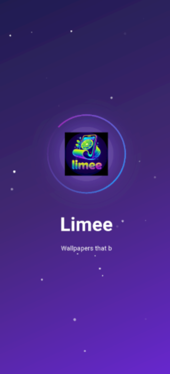 | 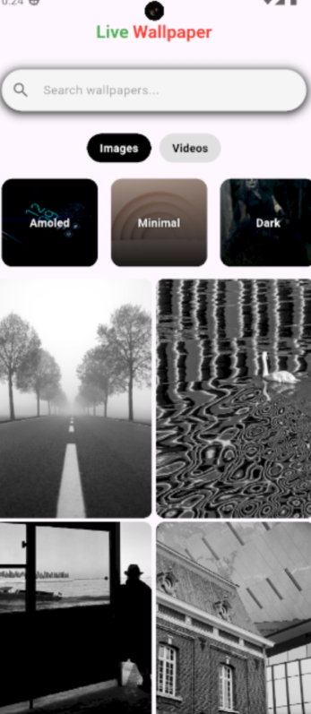 | 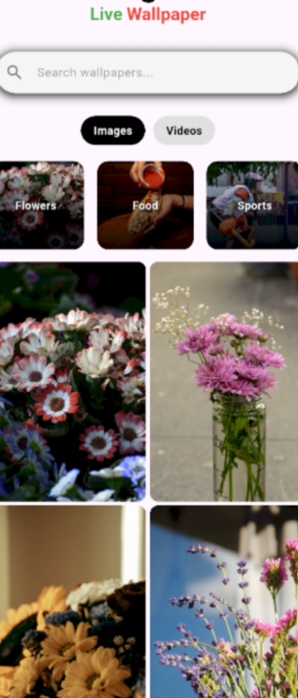 |

| Screenshot 4           | Screenshot 5           | Screenshot 6           |
| ---------------------- | ---------------------- | ---------------------- |
| 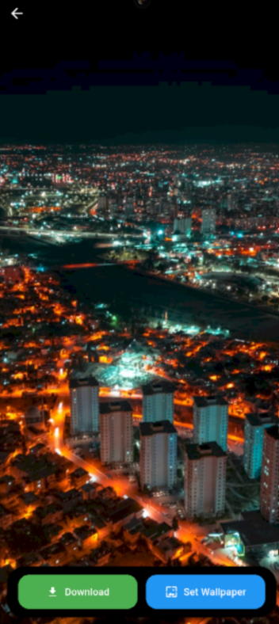 | 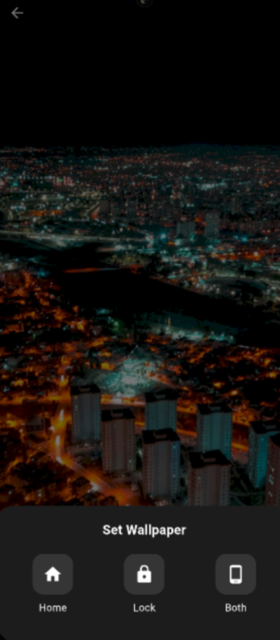 | 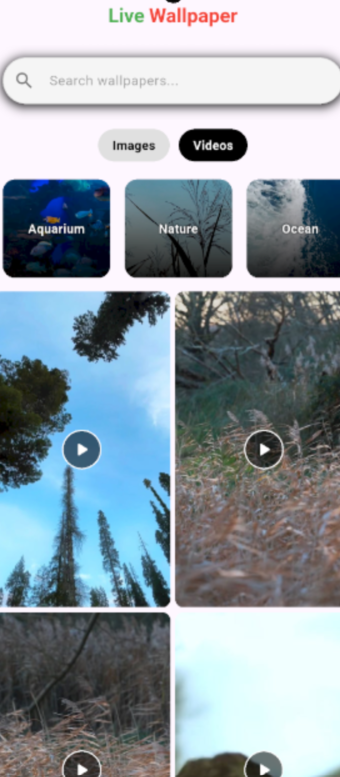 |

| Screenshot 7           | Screenshot 8           | Screenshot 9           |
| ---------------------- | ---------------------- | ---------------------- |
| 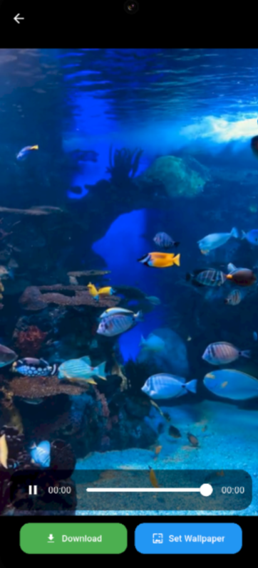 | 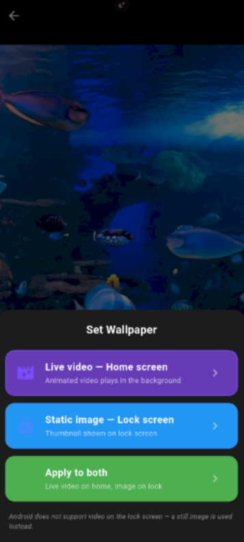 | 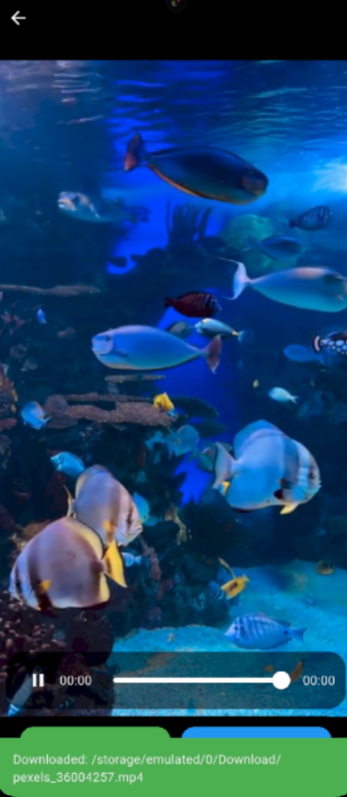 |

| Screenshot 10           | Screenshot 11           | Screenshot 12           |
| ----------------------- | ----------------------- | ----------------------- |
| 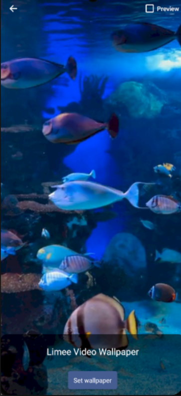 | 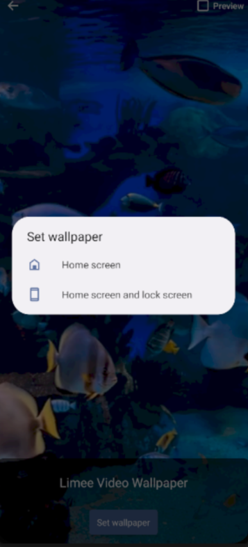 | 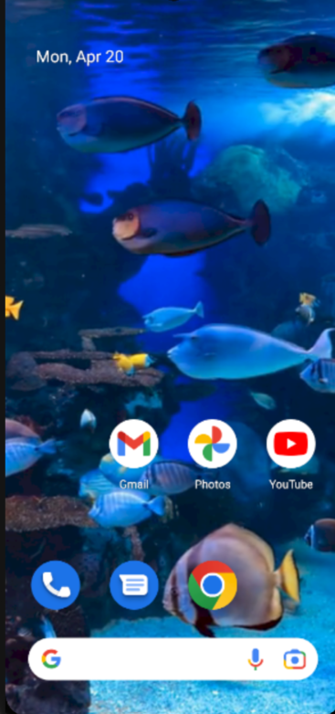 |

---

## ▶️ Getting Started

1. Clone the repository

```bash[
git clone https://github.com/San2021331091/limee.git
```

2. Navigate to project folder

```bash
cd wallpaper-app
```

3. Install dependencies

```bash
flutter pub get
```

4. Run the app

```bash
flutter run
```

---

## 🔑 API Setup

* Get your API key from **Pexels**
* Add it to your app (e.g., constants file or environment config)

---

## 📄 License

This project is licensed under the **MIT License**. 


## 📦 Downloads

- [AAB link](https://drive.google.com/file/d/176CqSMOZ5xmZdvzVZS2oXXfLF1jQjeXt/view?usp=sharing)  
- [APK link](https://upload.app/download/limee/com.example.wallpaper/748f20c5690dd204c41f6d4b83fbcd3e2285e5d4664f76ad850cbdbed7797bb0)
